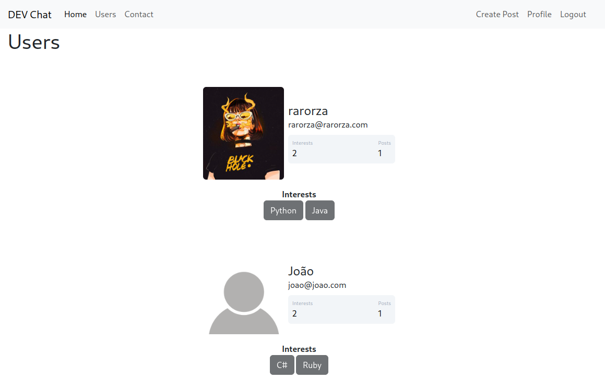
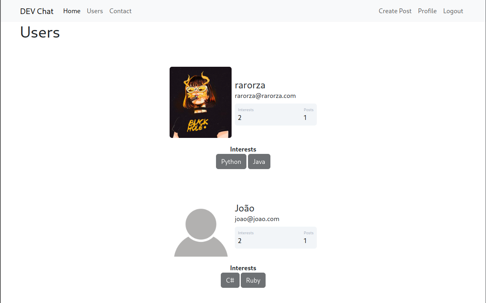
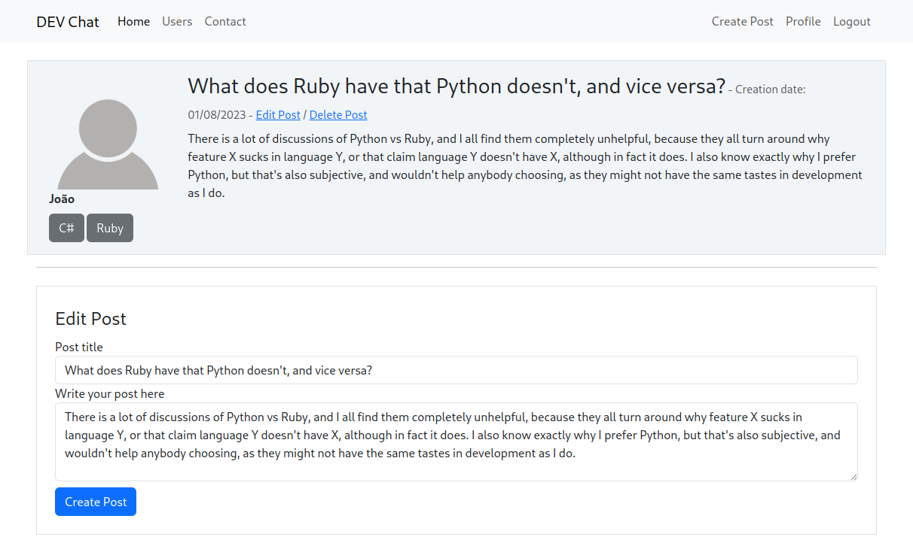

<h1 align="center"> DEV Chat </h1>

<p align="center">
Study project made in Flask, being a forum for developers. <br/>
</p>

1 - To run the application, clone the repository and install the dependencies with a virtual environment of your choice.

`$ pip install -r requirements.txt`

2 - Create an ```.env``` file in the project root with a ```SECRET_KEY = "YOUR SECRET KEY HERE"```

3 - Run:

`$ python run` or `$ flask --app app run`

<p align="center">
  
  
  
</p>
